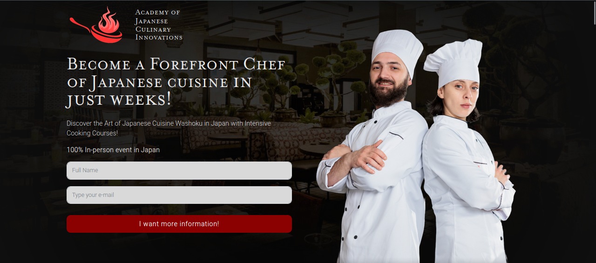

# Washoku Freelancer Project

### Washoku (English)

This is a freelance project created for a culinary school based in Japan. Its purpose is to capture leads for an in-person Japanese cooking course in Tokyo. After the lead fills out the form, their data is sent to an online Excel spreadsheet, and the company is notified via email.

### Washoku (Português)

Este é um projeto freelancer feito para uma empresa de cursos culinários cediados no Japão. Seu objetivo é capturar leads para realização de um curso de culinária japonesa presencial em Tokyo, após o lead preencher o formulário, seus dados vão para uma planilha do excel online, e a empresa é notificada via e-mail. 

## Technologies used:

